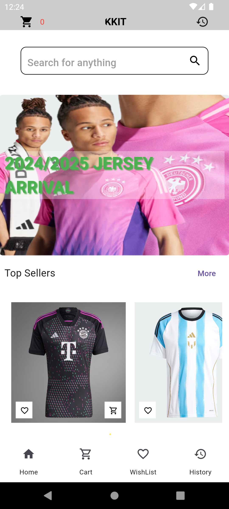

# kick_off_kits Mobile App

Welcome to **kick_off_kits** – Your ultimate mobile shopping solution! GadgetVerse allows users to effortlessly browse, buy gadgets, and place orders using the mobile app.

## Table of Contents
- [Features](#features)
- [Installation](#installation)
- [Usage](#usage)
  - [Browsing Products](#browsing-products)
  - [Placing an Order](#placing-an-order)
- [Screenshots](#screenshots)

## Features
- **User-Friendly Interface**: Simple and intuitive design for a seamless shopping experience.
- **Latest Gaming Devices and Best Programming Gadgets**: Get the latest and best gadgets in the market.
- **State Management with Provider**: Efficient state management using the Provider package for a reactive and scalable application.
- **MVC Architecture**: Seamless integration of the MVC (Model-View-Controller) architecture for clean and maintainable code.

## Installation
- **Download the app**: Available on [Google Drive](https://drive.google.com/drive/folders/16BAjMemZLMSYpd4BYOumm1o_4ukn93Mo).

## Usage

### Browsing Products
- **Home Screen**: Explore featured gadgets.

### Placing an Order
1. **Select Product**.
2. **Add**: Click on 'Add' to include the product in your shopping cart.
3. **View Cart**: Go to your cart to review selected items.
4. **Checkout**: Proceed to checkout by entering your shipping details.

## Screenshots
## HomePage

 
 
 
 

 
 
 
 

## Cart Page

 
 
 
 
 

## Payment Page
 

## View on Appetize
**Appetize**

*Interact with the website using this link:* [Appetize](https://appetize.io/app/b_xtbv5rnvgukscf2fke2isz5pny)
