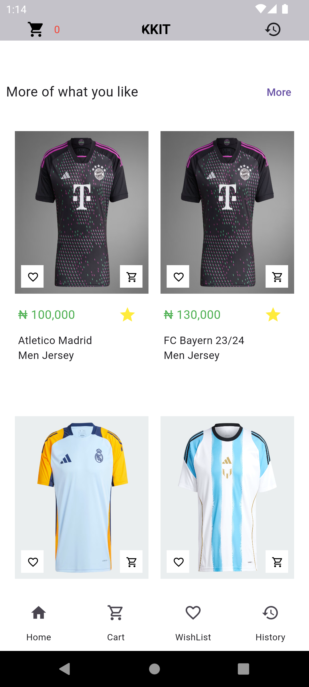
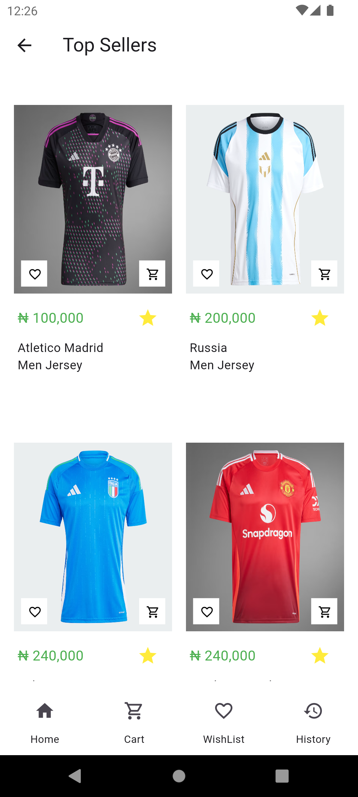
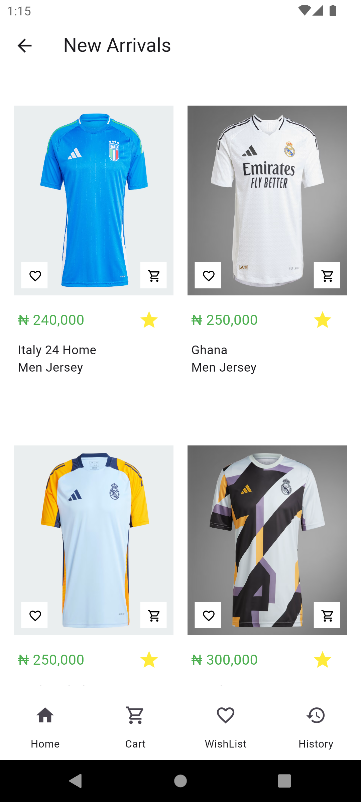
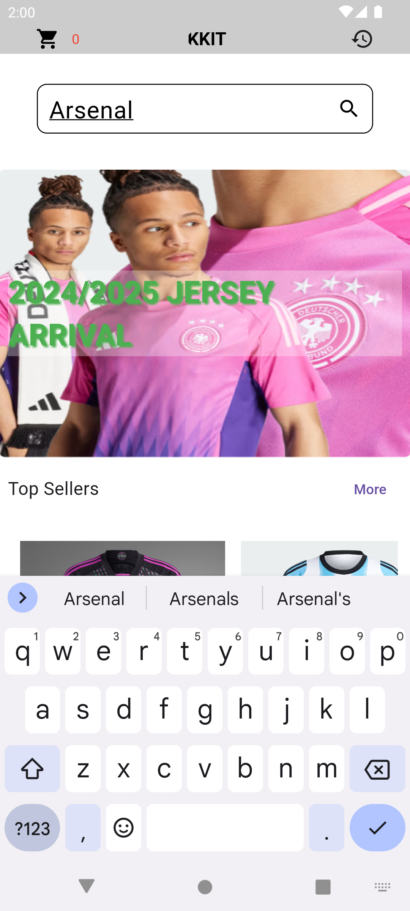
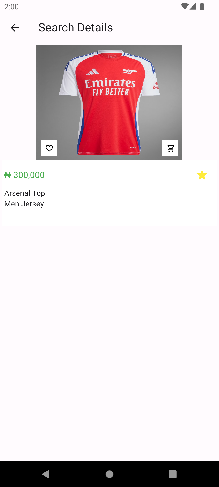
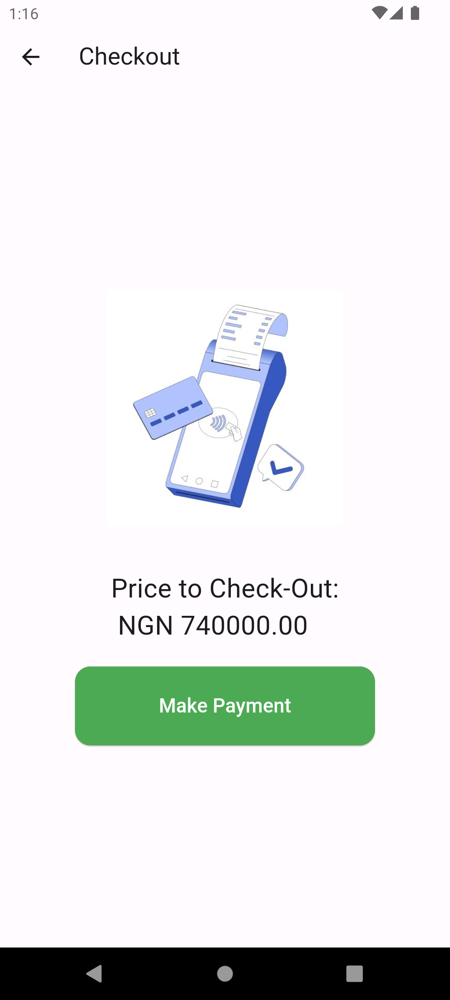
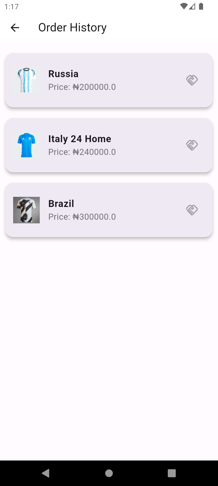
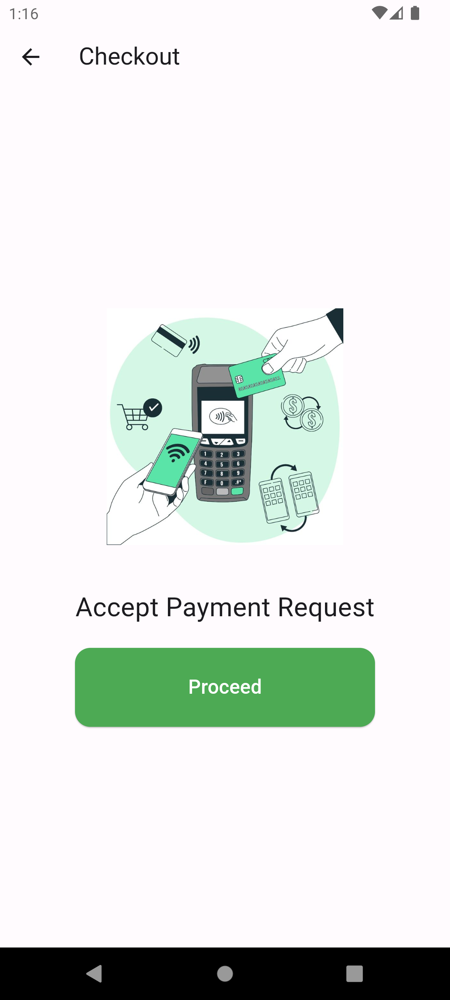

# Kick Off Kits Mobile App

**Kick Off Kits** is a dedicated shopping app for jersey enthusiasts, offering a wide range of jerseys from various clubs and countries. With a user-friendly interface and seamless navigation, users can easily browse, search, and purchase their favorite team jerseys. The app provides detailed product descriptions, high-quality images, and convenient features such as a wishlist and secure checkout, making it the ultimate destination for jersey shopping.

## Table of Contents
- [Features](#features)
- [Installation](#installation)
- [Usage](#usage)
  - [Browsing Products](#browsing-products)
  - [Placing an Order](#placing-an-order)
- [View on Appetize](#view-on-appetize)
- [Screenshots](#screenshots)
  - [Home Page](#home-page)
  - [All Products](#all-products)
  - [Category of Top Sellers](#category-of-top-sellers)
  - [Category of New Sellers](#category-of-new-sellers)
  - [Cart Page](#cart-page)
  - [Search Item](#search-item)
  - [Search Page Result](#search-page-result)
  - [Checkout Page](#checkout-page)
  - [Order History Page](#order-history-page)
  - [Order History Detail Page](#order-history-detail-page)
  - [Payment Page](#payment-page)

## Features
- **User-Friendly Interface**: Simple and intuitive design for a seamless shopping experience.
- **Wide Range of Jerseys**: Explore jerseys from various clubs and countries.
- **State Management with Provider**: Efficient state management using the Provider package for a reactive and scalable application.
- **MVC Architecture**: Seamless integration of the MVC (Model-View-Controller) architecture for clean and maintainable code.

## Installation
- **Download the app**: Available on [Google Drive](https://drive.google.com/file/d/1HO4HHGvQvCWLgfmb6mWT0Ng6me9zWEWM/view?usp=drive_link).

## Usage

### Browsing Products
- **Home Screen**: Explore featured jerseys and categories.

### Placing an Order
1. **Select Product**: Choose your desired jersey.
2. **Add to Cart**: Click on 'Add' to include the product in your shopping cart.
3. **View Cart**: Go to your cart to review selected items.
4. **Checkout**: Proceed to checkout by entering your shipping details and payment information.

## View on Appetize
**Appetize**: Interact with the app using this link: [Appetize](https://appetize.io/app/b_rdjora33gnqunb57r55cnsxhhy)

## Screenshots

### Home Page

    

 

### All Products

    

 

### Category of Top Sellers

    

 

### Category of New Sellers

    

 

### Cart Page

    

 

### Search Item

    

 

### Search Page Result

    

 

### Checkout Page

    

 

### Order History Page

    

 

### Order History Detail Page

    

 

### Payment Page

    

 
